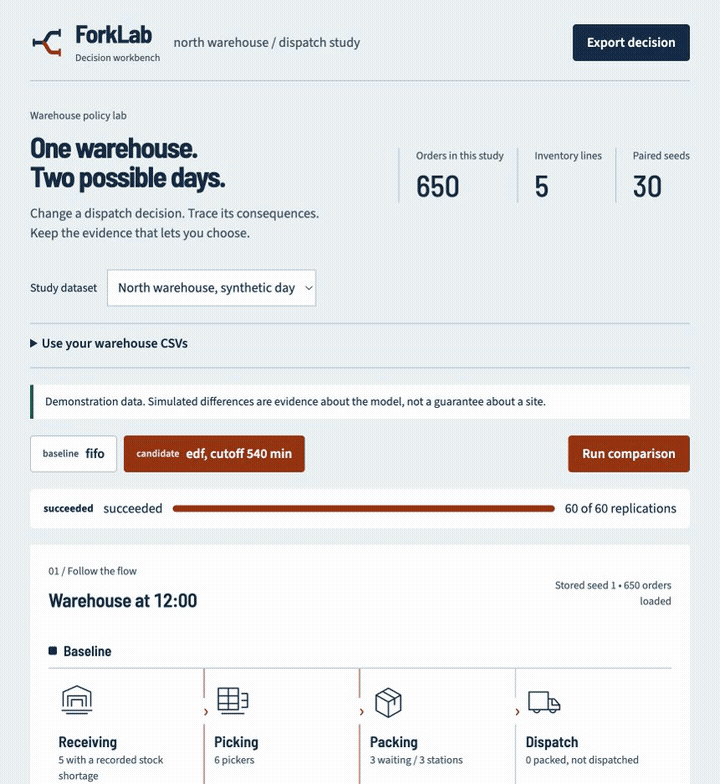
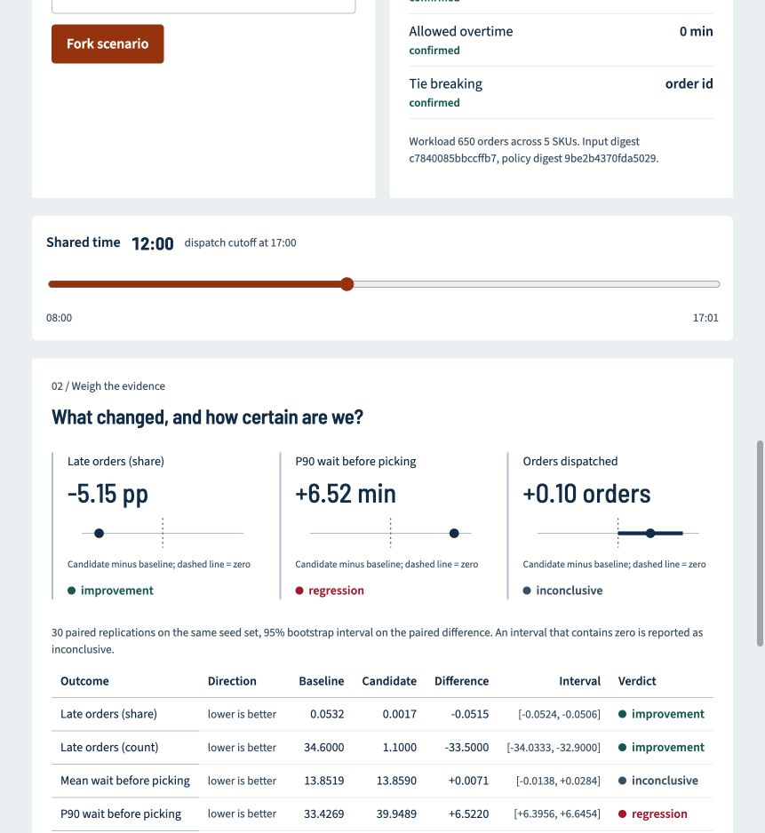

# ForkLab

**Rehearse a warehouse decision before changing the warehouse.**

An operations lead wants to know whether changing dispatch priority will reduce
missed deadlines without unacceptable overtime. ForkLab lets them fork a
scenario, run both versions against the same workload, and read a paired
comparison that says "inconclusive" when the evidence does not support a claim.

This is release one. It runs a single facility, on synthetic or imported CSV
data, with no API key and no paid service.

## See it in action



[Watch or download the MP4 tour](docs/media/forklab-walkthrough.mp4) ·
[Open the comparison screenshot](docs/media/04-comparison.png) ·
[Read the visual walkthrough](docs/walkthrough.md)

The GIF and video are a paced tour of real application screenshots using the
650-order synthetic demo. They are not a real-time recording or a claim about
simulation speed. Static screenshots and the written guide below cover the same
steps without animation.

---

## What the first run shows

```
$ uv run forklab demo

Synthetic day: 650 orders across 5 SKUs
Facility: 6 pickers, 3 packing stations, shift ends at minute 540
Assumptions: shift (confirmed), processing_times (estimated), pickers (confirmed), packing_stations (confirmed)

Invariants on the baseline run: clean

Baseline, first in first out:
  late orders 36 of 650
    standard   0.2% late
    express    27.6% late
```

First in first out looks fine in aggregate and is quietly failing express
orders. Forking to earliest deadline first, over 30 paired replications on the
same seed set:

```
Outcome                           Baseline   Candidate   Difference            95% interval  Verdict
----------------------------------------------------------------------------------------------------
Late orders (share)                 0.0532      0.0017      -0.0515      [-0.0524, -0.0506]  improvement
Late orders (count)                34.6000      1.1000     -33.5000    [-34.0333, -32.9000]  improvement
Mean wait before picking           13.8519     13.8590      +0.0071      [-0.0138, +0.0284]  inconclusive
P90 wait before picking            33.4269     39.9489      +6.5220      [+6.3956, +6.6454]  regression
Mean order cycle time              33.7699     33.7533      -0.0166      [-0.0556, +0.0241]  inconclusive
Overtime worked                     0.0682      0.0457      -0.0226      [-0.0858, +0.0199]  inconclusive
Unfulfilled orders                  0.0000      0.0000      +0.0000      [+0.0000, +0.0000]  inconclusive
Missed dispatch cutoff              0.2000      0.1000      -0.1000      [-0.2000, +0.0000]  inconclusive
Orders dispatched                 649.8000    649.9000      +0.1000      [+0.0000, +0.2000]  inconclusive
```

That is the decision, stated honestly. Lateness drops from 5.3 percent to
0.17 percent, and the tail of the picking queue gets 6.5 minutes worse. Six of
the nine outcomes are inconclusive and are labelled as such rather than being
dressed up as small wins.

Every number above came from executing the simulator. None of them were typed
by hand.

---

## Install and run

Requires Python 3.12 or newer and [uv](https://docs.astral.sh/uv/). Node 20 is
needed only for the web workbench.

```bash
git clone https://github.com/Genious07/forklab.git
cd forklab
uv sync

uv run forklab demo      # the full walkthrough, about 15 seconds
uv run forklab verify    # invariants, the hand solvable case, reproducibility
```

For the web workbench:

```bash
make install
make dev                 # builds the bundle, serves API and UI on :8000
```

Open <http://localhost:8000>. The sample warehouse is already loaded. Fork a
scenario, run the comparison, drag the shared time scrubber, and select a late
order to see where it waited.

---

## How to use the workbench

After `make install` and `make dev`, open <http://localhost:8000>.

1. **Run the sample baseline.** Keep **North warehouse, synthetic day** selected
   in **Study dataset**, then click **Run baseline**. Wait for `succeeded` and
   **650 orders loaded**. This establishes the first-in-first-out reference.
2. **Create a different policy.** In **Fork a scenario**, select **Earliest
   deadline first**. Leave dispatch cutoff at **540** and overtime at **0** for
   this first comparison. Click **Fork scenario**. An orange candidate tab appears.
3. **Run both policies.** Click **Run comparison**. The progress strip reaches
   **60 of 60 replications**: 30 baseline runs and 30 candidate runs on paired
   seeds. **Stop** requests cancellation; refreshing the page restores the study.
4. **Trace the process.** Drag **Shared time** to inspect both lanes at the same
   point in the day. The map shows stored seed 1, while the comparison aggregates
   all 30 pairs. Packed but undispatched orders are shown separately from sent orders.
5. **Read the tradeoff.** Under **What changed, and how certain are we?**, the
   demo reports about **5.15 percentage points fewer late orders**, but **6.52
   minutes more P90 waiting**. Read the interval, verdict and full table together.
   A positive difference means candidate minus baseline, not automatically better.
6. **Explain one order.** Select the candidate tab, find **D0035** under
   **Follow a single order**, then select its row. Its timeline shows a stock
   shortage before picking. Switch lanes to investigate the corresponding baseline.
7. **Keep a reproducible decision.** Click **Export decision** after the comparison
   succeeds. Replay the downloaded JSON with the command below, using its actual filename.

```bash
uv run forklab replay ~/Downloads/forklab-decision-EXPERIMENT_ID.json
```



### Use your own CSVs

Expand **Use your warehouse CSVs**, choose the required orders and inventory files,
optionally add replenishments, then click **Import dataset**. A successful import
selects the new dataset. Fix reported errors before resubmitting.

| File | Columns |
| --- | --- |
| `orders.csv` | `order_id,sku,quantity,arrival,deadline,service_class` |
| `inventory.csv` | `sku,on_hand` |
| `replenishments.csv` (optional) | `sku,quantity,arrival` |

Use [the demo CSVs](fixtures/demo) as templates. Imports allow 5,000 orders and
2 MiB per file. Use **numeric minutes from 08:00** for the current single-day
model: `0` is 08:00 and `540` is 17:00. Although the legacy parser accepts clock
and ISO strings, ISO dates and offsets are discarded; do not use it for mixed
dates or time zones. Imported facility settings start as **estimated**. Inspect
the assumptions before interpreting a result; the current UI does not calibrate
the facility model from your files.

### An import never silently drops a row

```
$ uv run forklab run --data ./my-warehouse
Import rejected 3 rows.
  line 3: Input should be greater than 0
  line 4: Value error, order A3: deadline 30.0 precedes arrival 60.0
  line 5: cannot read time 'notatime', expected minutes, HH:MM, or ISO
```

The API returns the same rejections as a repair file: the offending rows only,
with a `rejection_reason` column appended, ready to fix and resubmit.

---

## Why an order was late

Selecting order `D0035` in the workbench produces its event path:

```
11:40  Order arrived                  sku: SKU-C, quantity: 2
11:40  Blocked, not enough stock      sku: SKU-C, required: 2, on_hand: 0
13:02  Stock reserved                 sku: SKU-C, quantity: 2
13:02  Picking started
13:05  Picking finished
13:06  Packing started
13:08  Packing finished
13:08  Dispatched                     deadline: 280.47, late: 1
```

This trace records a stock shortage at 11:40 and stock reservation at 13:02.
Picking began about 82 minutes after arrival, then the order cleared the remaining
process in about 6 minutes. The trace identifies where to investigate; it does
not prove that every possible dispatch policy would have the same outcome.

---

## Correctness before optimization

The simulator is checked against a case that can be worked out on paper: ten
identical orders, one picker, one packer, quantity 2 each. Picking takes
3.0 minutes and packing 2.0, so the picker is the bottleneck and order k
dispatches at `3k + 2`.

```
$ uv run forklab verify
Hand solvable case
  dispatch times match the hand calculation: [5.0, 8.0, 11.0, 14.0, 17.0, 20.0, 23.0, 26.0, 29.0, 32.0]
Invariants on the demo day
  clean: stock conserved, capacity respected, one terminal state per order
Reproducibility
  identical seeds reproduce identical event logs
```

The invariant checker reads the event log rather than the simulator's internal
state, so a bug cannot mark itself valid. It checks that stock is never
oversold or driven negative, that concurrency never exceeds the configured
pickers or packing stations, that work never starts before arrival, and that
every order reaches exactly one terminal state.

It earned its place during development by catching two real bugs: a final sort
of the event log by `(minute, order_id)` was reordering same-minute events so a
`pack_start` could appear before the `pack_end` that released the station, and
the same sort was placing order consumption ahead of the inbound delivery that
supplied it.

```
$ uv run pytest tests/
68 passed
```

---

## Reproducibility

Three deliberate choices make a run replayable:

1. Service time variability is drawn once per order per stage from a seeded
   RNG **before** the simulation starts, in sorted order id order. Nothing is
   drawn inside a running process, so the event log does not depend on the
   order SimPy happens to schedule concurrent work.
2. Work assignment is event driven, with no polling loops and no worker
   processes racing each other.
3. Every compiled policy produces a **total** order over waiting orders, so
   ties never resolve by scheduling accident.

An exported manifest can be recomputed:

```
$ uv run forklab replay decision.json
  engine in manifest forklab-sim-0.1.1, running forklab-sim-0.1.1
  30 paired replications
  every recorded metric reproduced exactly
```

If any recorded value diverges, replay names the field and exits nonzero.

---

## How the comparison avoids overclaiming

- Arms are **paired on the seed**, so replication *i* of both arms sees the
  same sampled variability and the difference isolates the policy.
- Every metric reports a percentile bootstrap interval on the paired
  difference. An interval containing zero is reported as **inconclusive**, not
  as a small win.
- Every metric declares a **direction**. A larger number is not automatically
  better, so `Orders dispatched` falling is a regression while `Late orders`
  falling is an improvement.
- Comparing a scenario against itself yields inconclusive on every metric.
  There is a test that asserts exactly this.
- Fewer than 30 paired replications is flagged in the report as exploratory.
- Unpaired seeds are excluded and reported rather than quietly averaged.

### A worked trap

Moving the dispatch cutoff one hour earlier reports:

```
Mean order cycle time              33.7699     28.5850      -5.1849      [-5.3010, -5.0607]  improvement
Orders dispatched                 649.8000    578.4333     -71.3667    [-72.3000, -70.4000]  regression
```

Cycle time "improved" only because 71 slow orders never got dispatched at all
and therefore left the average. This is survivorship, not a gain. ForkLab shows
both rows side by side and warns when dispatched counts differ. Read the
throughput row with the timing rows.

---

## Commands

| Command | Purpose |
|---|---|
| `forklab demo` | Full walkthrough on synthetic data |
| `forklab verify` | Invariants, hand solvable case, reproducibility |
| `forklab run` | Run one policy and report its metrics |
| `forklab compare` | Paired baseline against candidate, optional manifest |
| `forklab export-fixtures` | Write the synthetic day out as CSV |
| `forklab replay` | Recompute a manifest and check it reproduces |

```bash
uv run forklab compare \
  --strategy fifo \
  --candidate-strategy edf \
  --replications 30 \
  --manifest decision.json
```

---

## Repository layout

```
packages/domain/        Models, policies, simulator, invariants, CSV import
packages/evaluation/    Metrics and paired comparison, from event logs only
packages/cli/           Command line and decision manifests
services/api/           FastAPI control plane, durable jobs
services/worker/        Standalone job runner
apps/web/               React and TypeScript workbench
fixtures/demo/          Synthetic, redistributable sample data
tests/                  Unit and integration tests
```

The evaluation package does not import the simulator's internal state. It reads
the event log the way an external auditor would, so a metric cannot be produced
by anything the log does not record.

---

## Limitations

Read [docs/limitations.md](docs/limitations.md) before showing a result to
anyone who might act on it. The short version:

- **The model is not calibrated.** Processing times are estimated, not measured
  against facility history. A simulated difference is evidence about the model,
  not a prediction about your site.
- **Authentication is a stub.** Every query is organization scoped and there is
  a test proving cross-organization reads return 404, but identity resolves
  from a header. Do not expose this to the internet without replacing
  `current_org` with a real identity provider.
- **Single facility, single day.** No multi-site flow, no carry-over between
  days, no named staffing decisions, no robotics.
- **Aggregate travel model.** Zone distance is not modelled. Picking time is
  setup plus per unit, not a routing problem.
- **No AI policy proposer yet.** Policies are constrained JSON compiled to
  trusted functions. Model generated Python is deliberately out of scope until
  the baseline and measurements are trustworthy.
- **Bootstrap intervals assume the replications are exchangeable.** With a
  fixed workload they describe run to run variability, not uncertainty about
  next Tuesday.

---

## Documentation

- [docs/walkthrough.md](docs/walkthrough.md) screenshot tour and usage steps
- [docs/architecture.md](docs/architecture.md) how the pieces fit
- [docs/limitations.md](docs/limitations.md) what this does not establish
- [docs/operations.md](docs/operations.md) deploy, back up, recover

## License

MIT. See [LICENSE](LICENSE).
