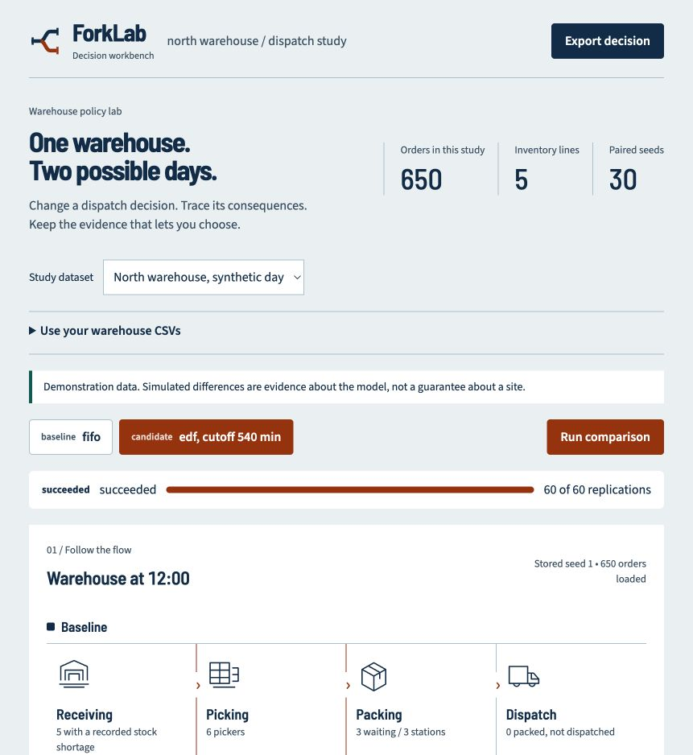
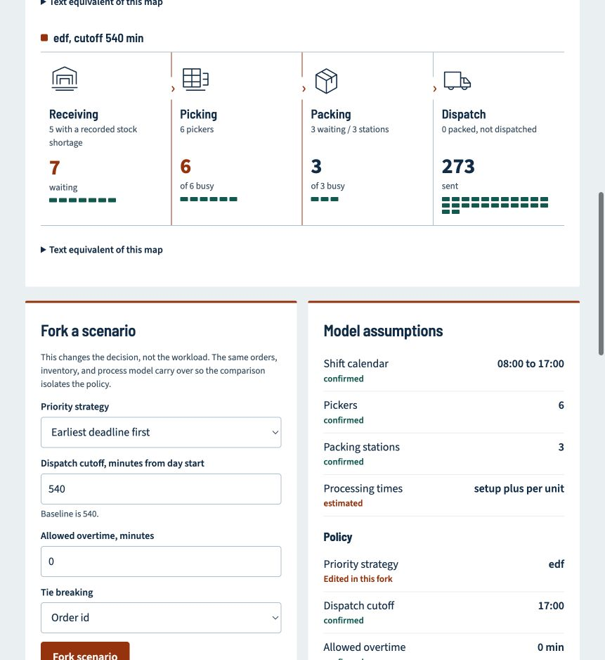
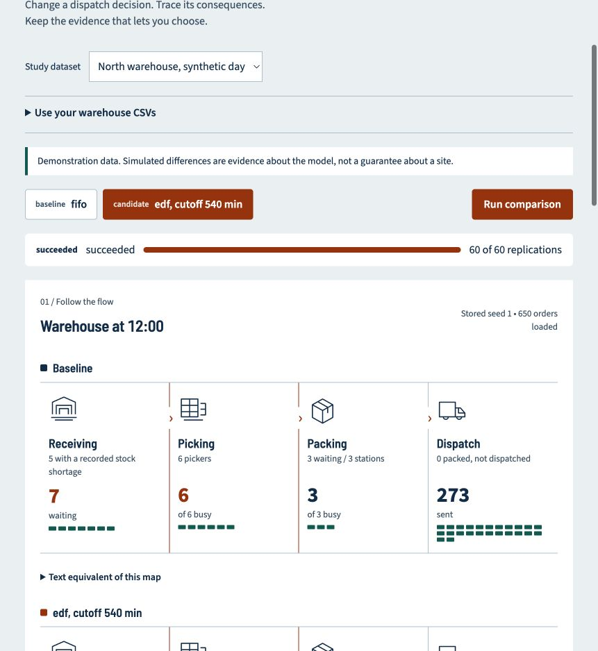
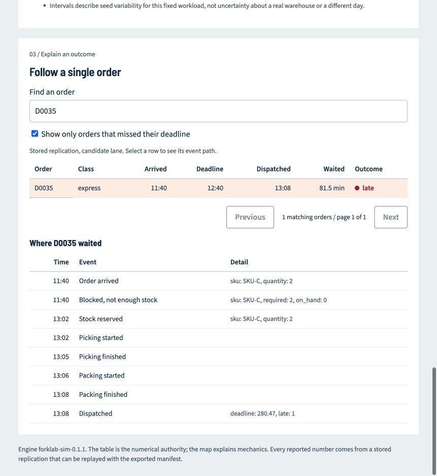

# ForkLab visual walkthrough

[Back to the README](../README.md) · [MP4 screenshot tour](media/forklab-walkthrough.mp4)

Start with `make install`, then `make dev`, and open <http://localhost:8000>.
No API key is required. Screenshots below show the synthetic 650-order demo,
engine `forklab-sim-0.1.1`. The screenshots were captured from a completed study;
the steps describe how to create that study from a fresh start.

## 1. Establish a baseline

Select **North warehouse, synthetic day** in **Study dataset**. Click **Run
baseline**, then wait for `succeeded` and **650 orders loaded**. The baseline uses
first-in-first-out priority. The screenshot shows the workbench after a comparison,
so its action reads **Run comparison** rather than **Run baseline**.



## 2. Fork the dispatch policy

In **Fork a scenario**, choose **Earliest deadline first**. Keep cutoff at 540
minutes and allowed overtime at zero, then click **Fork scenario**. Inspect the
adjacent model assumptions. Orange identifies the candidate; it does not mean the
policy is better. The candidate inherits the same orders, inventory and facility.



## 3. Run and inspect the process

Click **Run comparison**. Wait for **60 of 60 replications**. Drag **Shared time**
to compare the lanes at one point in the day. The map uses stored seed 1 and shows
waiting orders, resource use and dispatched orders. The statistics use all 30 pairs.
The current UI restores the experiment when you refresh the page.



## 4. Read both benefits and costs

The candidate lowers late orders by about **5.15 percentage points**, while P90
waiting rises by **6.52 minutes**. The signed number is candidate minus baseline.
The dashed line is zero difference; the horizontal segment is the bootstrap
interval. Each graphic has its own scale, so compare numbers rather than lengths
across metrics. The table beneath gives exact values and verdicts.

An inconclusive result is not evidence of no effect. These intervals describe
seed variability for one modeled day, not uncertainty about a real facility.


## 5. Investigate and export

Select the candidate lane, search **D0035** under **Follow a single order**, and
select the row. The recorded stock shortage and later reservation identify an
inventory-related wait that deserves investigation. Switch lanes to inspect the
baseline. Clear the late-only filter when searching for an order that was on time.



After a comparison succeeds, click **Export decision**. Replay the downloaded file:

```bash
uv run forklab replay /path/to/forklab-decision-EXPERIMENT_ID.json
```

Use the engine version recorded in the manifest for exact replay. For your own
CSV data, follow the [README import instructions](../README.md#use-your-own-csvs).
Before public deployment, read the [limitations](limitations.md) and
[operations guide](operations.md).
